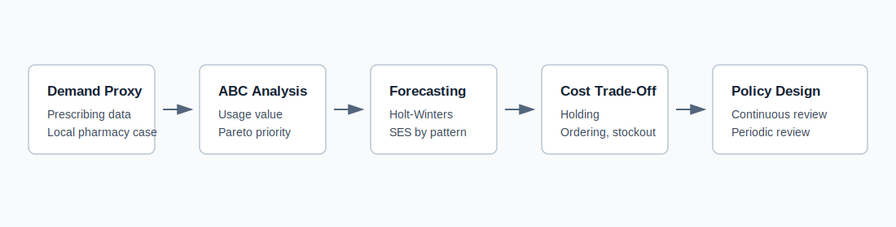
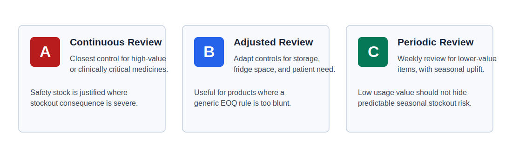

# Pharmacy Inventory Operations Analytics

This project presents an operations analytics case study for a community pharmacy inventory system. It focuses on how a pharmacy can prioritise medicines, forecast demand, manage stockout risk, and choose practical replenishment policies across products with different demand, cost, storage, and clinical-risk profiles.

## Business Problem

Community pharmacies need to maintain medicine availability while avoiding unnecessary stock, expiry waste, cold-chain pressure, and administrative burden. The central question is:

> How should a pharmacy design an inventory control system that balances cost efficiency with patient service level and clinical risk?

The case study uses a local pharmacy scenario and prescribing-demand proxy data to recommend differentiated inventory policies rather than a single rule for all medicines.

## My Role

This was adapted from a group Operations Analytics presentation where I led the team. My role included structuring the analytical approach, coordinating the presentation narrative, aligning the analysis to the marking brief, and helping translate technical inventory methods into clear operational recommendations.

## Project Context

The analysis considers a pharmacy inventory portfolio including medicines such as Dapagliflozin, EpiPen, Mounjaro, Sertraline, Amoxicillin, and Fexofenadine. Demand was modelled using publicly available prescribing data as a proxy for local demand patterns.

The source presentation was awarded 87%, the highest mark in the cohort, and was later used as an exemplar teaching resource.

## Key Findings

| Finding | Evidence | Operational Implication |
|---|---:|---|
| A-items drove most inventory value | Dapagliflozin and EpiPen represented 68.7% of total usage value | Highest-value and highest-risk items need close control |
| ABC classification alone was insufficient | C-class products still showed seasonality and operational risk | Classification should include demand variability and clinical consequence |
| Seasonal products needed forecasting uplift | Amoxicillin rose from 226 to 945 units from September to October | Seasonal stock build should begin before expected demand spikes |
| Stable products suited simpler methods | Sertraline showed stable repeat demand with CV of 17.6% | Simple Exponential Smoothing can be enough for stable chronic-demand products |
| Service level should reflect clinical risk | EpiPen stockout risk is clinically severe | Near-zero stockout tolerance is justified for selected A-items |

## Analytical Approach



The project combined:

1. ABC inventory classification
2. Pareto-style value concentration analysis
3. Product-level demand pattern assessment
4. Forecasting method selection using demand characteristics
5. Inventory cost analysis
6. Tracking policy design by ABC class
7. EOQ illustration for a stable, high-volume medicine
8. Service-level and stockout-risk evaluation

## Methods Used

| Method | Purpose |
|---|---|
| ABC classification | Prioritise items by annual usage value |
| Demand variability review | Compare stable and seasonal products |
| Holt-Winters forecasting | Recommended for seasonal demand such as Amoxicillin and Fexofenadine |
| Simple Exponential Smoothing | Recommended for stable repeat demand such as Sertraline |
| EOQ | Illustrated the ordering-holding cost trade-off for Sertraline |
| Continuous review `(s, Q)` | Recommended for high-value or high-risk A-class products |
| Periodic review `(R, S)` | Recommended for lower-value C-class products with adjusted seasonal uplifts |

## Recommended Inventory Policy



### A-Class Medicines

Use continuous review with safety stock. For clinically critical medicines such as EpiPen, the cost of expiry or holding excess stock is outweighed by the service-level and patient-safety risk of stockout.

### B-Class Medicines

Use adjusted continuous review where product constraints matter. For example, refrigerated products such as Mounjaro should consider fridge capacity and patient-specific ordering rather than applying a generic EOQ rule.

### C-Class Medicines

Use weekly periodic review with seasonal uplift for products such as Amoxicillin and Fexofenadine. Low usage value should not mean low attention when seasonal spikes are predictable.

## Service-Level Logic

The proposed service level is the percentage of prescription items supplied immediately at first visit. This matters because pharmacy stockouts are not only lost sales; they can create patient harm, emergency sourcing, and owed-item workflows.

The final recommendation is to prioritise near-zero stockout risk for clinically critical A-items while using lower-cost periodic review for lower-value C-items, with seasonal exceptions where demand patterns justify higher stock.

## Repository Structure

```text
pharmacy-inventory-operations-analytics/
|-- assets/
|   |-- inventory_analytics_workflow.svg
|   `-- policy_recommendations.svg
|-- docs/
|   |-- source_handling.md
|   `-- methods_summary.md
|-- results/
|   `-- key_insights.md
|-- .gitignore
`-- README.md
```

## Tools And Skills Demonstrated

- Operations analytics
- Inventory classification
- ABC analysis
- Demand forecasting
- Forecasting method selection
- EOQ interpretation
- Inventory policy design
- Service-level thinking
- Supply-chain risk analysis
- Group leadership and stakeholder communication

## Limitations

The pharmacy demand values were based on public prescribing data used as a proxy for local demand, not the pharmacy's exact internal dispensing history. Supplier assumptions were also illustrative because the pharmacy's exact wholesaler was not publicly confirmed. The resulting recommendations should therefore be treated as decision-support logic requiring validation against real pharmacy stock, dispensing, lead-time, and expiry records.

## Academic Note

This project was adapted from a Distinction-grade MSc Operations Analytics group presentation awarded 87%, the highest mark in the cohort, and later used as an exemplar teaching resource. The public portfolio version removes student identifiers, university submission material, raw presentation files, and assignment-specific wording. It presents the work as a professional operations analytics case study while acknowledging the group-project context and my role as team lead.
